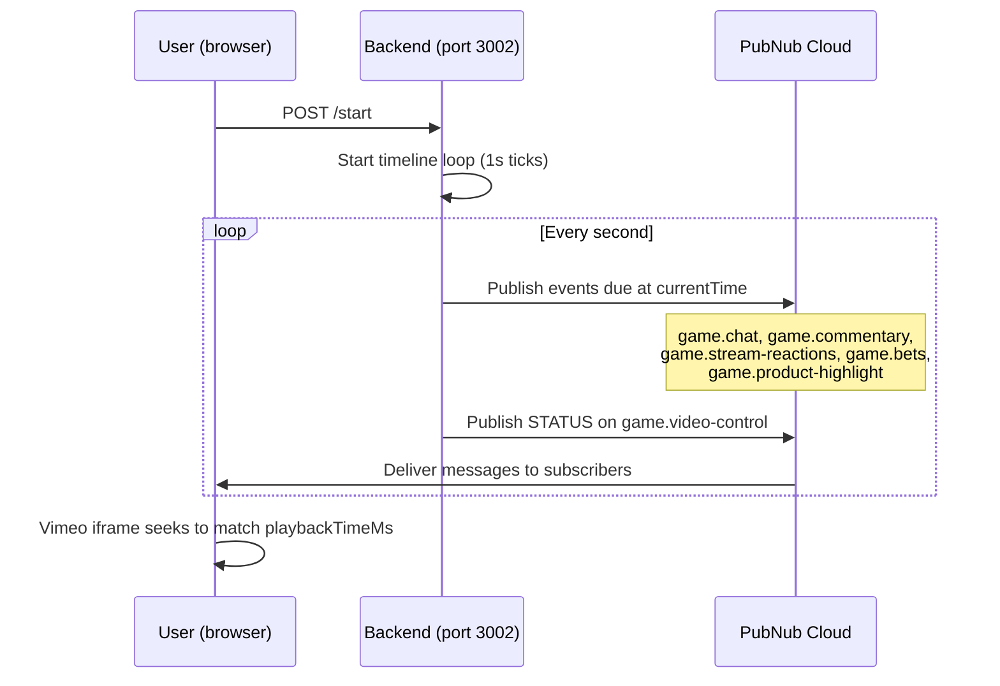

# Complete Status Audit and AI Handoff Prompt

## What Was Done (and What Probably Does Not Work Yet)

All code changes are in place but were **never successfully tested end-to-end** due to persistent Next.js cache corruption, port conflicts, and dependency churn throughout the session. The user kept hitting build errors that masked whether the actual feature code works.

### Current Architecture

### Feature-by-Feature Status

**1. Soccer Video (Vimeo embed)**

- Code: `liveStreamPage.tsx` lines 426-434 -- Vimeo iframe with `VIMEO_VIDEO_ID = '1073970603'`
- Status: Code looks correct. The `?background=1&autoplay=1&loop=1&muted=1` parameters should auto-play. **Untested** due to build failures.

**2. Video Sync Across Tabs**

- Backend: `backend/index.js` lines 238-249 -- publishes `{type: "STATUS", playbackTimeMs: currentTime}` to `game.video-control` every second
- Frontend: `liveStreamPage.tsx` lines 242-278 -- subscribes to `game.video-control`, uses `@vimeo/player` SDK to seek iframe if drift > 3 seconds
- **Potential issue**: Vimeo's `?background=1` mode may restrict API access (seeking). The `@vimeo/player` SDK may not be able to call `setCurrentTime()` on background-mode embeds. This needs testing.

**3. Product Highlights (the cards that appear over the video)**

- Backend: `backend/index.js` lines 79-104 -- builds `PRODUCT_HIGHLIGHT` and `PRODUCT_DISMISS` events from [products.json](backend/game-data/products.json)
- Timeline: Products appear at **5s, 55s, 105s, 155s** and last **40 seconds** each
- Frontend subscription: `liveStreamPage.tsx` lines 213-224 -- listens on `game.product-highlight`
- Frontend render: `liveStreamPage.tsx` lines 707-715 -- renders `ProductCardOverlay` when `activeProduct` is set
- Images: All 4 referenced images exist at `web/public/ads/ad-offer1.png`, `ad-offer2.png`, `ad-offer5.png`, `ad-offer6.png`
- **Status**: Code is wired up correctly. Should work if the app builds and backend timeline runs.

**4. Live Commentary**

- Backend: `backend/game-data/commentary.js` -- 127 soccer commentary events, first at 2000ms, last at 1208000ms
- Published to `game.commentary` via the same timeline
- Frontend: [LiveCommentary.tsx](web/app/components/LiveCommentary.tsx) subscribes to `game.commentary`, renders messages with timeCode
- Rendered at: `liveStreamPage.tsx` lines 702-704
- **Status**: Code is wired up. Should work if the app builds.

**5. Cart System**

- [useCart.ts](web/app/hooks/useCart.ts) persists cart to PubNub App Context (user custom metadata)
- [CartPanel.tsx](web/app/components/CartPanel.tsx) renders cart overlay
- Shopping bag button in bottom bar at `liveStreamPage.tsx` lines 783-796
- **Status**: Fully implemented, should work.

**6. Betting System**

- Existing feature from original demo, unchanged
- [useBets.ts](web/app/hooks/useBets.ts) and [BetCard.tsx](web/app/components/BetCard.tsx)
- Bet data comes from [bets.json](backend/game-data/bets.json)

**7. Chat + Reactions**

- Existing features, unchanged and known to work from original demo

### Known Issues That Need Fixing

1. **Never tested end-to-end** -- The `.next` cache was deleted and ports were freed, but the user never successfully ran a clean `./start.sh` + `curl -X POST http://localhost:3002/start` cycle
2. **Vimeo background mode may block seeking** -- `?background=1` hides controls and autoloops, but may prevent `@vimeo/player` API from seeking. If so, need to change to `?autoplay=1&loop=1&muted=1` without `background=1`, or switch to a different video source
3. **Commentary messages arrive sparsely** -- The first commentary is at 2s, then they're scattered across 20 minutes. The first minute may feel empty
4. **No product images validation** -- The images exist on disk but the Next.js dev server needs to actually serve `/ads/ad-offer1.png` from `web/public/ads/`

### File Map

| File                                                                                   | Purpose                                                       |
| -------------------------------------------------------------------------------------- | ------------------------------------------------------------- |
| [backend/index.js](backend/index.js)                                                   | Timeline engine, PubNub publisher, Express API                |
| [backend/game-data/products.json](backend/game-data/products.json)                     | 4 soccer products with display timings                        |
| [backend/game-data/commentary.js](backend/game-data/commentary.js)                     | 127 soccer commentary events                                  |
| [backend/game-data/bets.json](backend/game-data/bets.json)                             | Betting proposals                                             |
| [backend/game-data/chat.js](backend/game-data/chat.js)                                 | Simulated chat messages                                       |
| [backend/game-data/reactions.js](backend/game-data/reactions.js)                       | Emoji reaction events                                         |
| [web/app/pages/liveStreamPage.tsx](web/app/pages/liveStreamPage.tsx)                   | Main UI (932 lines) - video, chat, products, commentary, bets |
| [web/app/components/LiveCommentary.tsx](web/app/components/LiveCommentary.tsx)         | Commentary overlay                                            |
| [web/app/components/ProductCardOverlay.tsx](web/app/components/ProductCardOverlay.tsx) | Product card with expand/add-to-bag                           |
| [web/app/components/CartPanel.tsx](web/app/components/CartPanel.tsx)                   | Shopping cart slide-out                                       |
| [web/app/types/product.ts](web/app/types/product.ts)                                   | Product types and color mapping                               |
| [web/app/hooks/useCart.ts](web/app/hooks/useCart.ts)                                   | Cart state persisted to PubNub                                |
| [web/app/data/constants.ts](web/app/data/constants.ts)                                 | Channel IDs                                                   |
| [start.sh](start.sh)                                                                   | Runs backend + frontend together                              |

### PubNub Channels

- `game.chat` -- simulated fan chat messages
- `game.commentary` -- soccer commentary text
- `game.stream-reactions` -- emoji reactions
- `game.bets` / `game.bet-results` -- betting system
- `game.product-highlight` -- PRODUCT_HIGHLIGHT / PRODUCT_DISMISS
- `game.video-control` -- STATUS with playbackTimeMs (video sync)
- `game.stream-status` -- PiP stream status (Red5 WebRTC)
- `game.server-control` -- START/STOP commands to backend

### Environment

- Backend `.env`: PubNub pub/sub/secret keys, `GUIDED_DEMO=true`, `PORT=3002`
- Frontend `.env`: PubNub pub/sub keys (NEXT_PUBLIC_ prefixed), Red5 host config
- Both use the same PubNub keyset

## Plan: What to Create

### 1. HANDOFF.md

A comprehensive markdown document at the project root containing:

- Everything above (the full audit)
- A copy-paste-ready prompt for another AI session
- Step-by-step instructions for testing

### Todos

